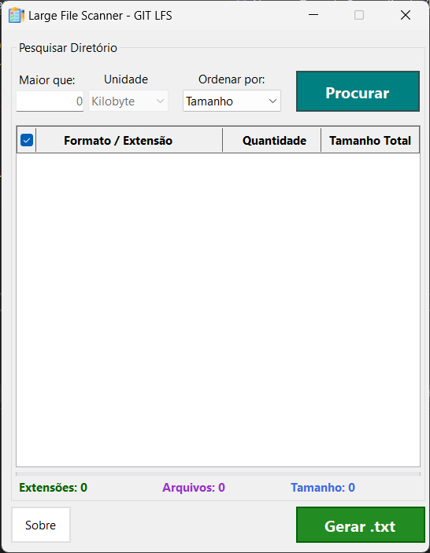
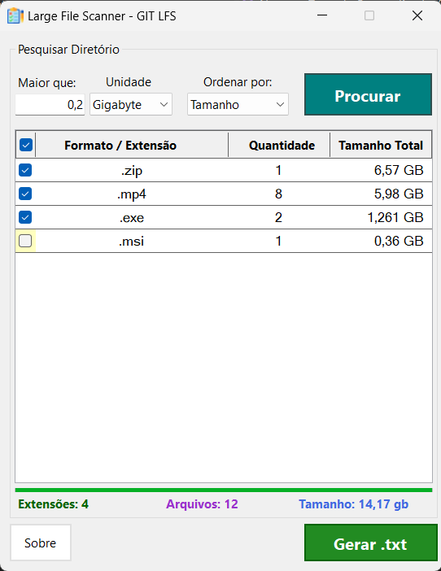

## Large File Scanner ##

    

O **Large File Scanner** é uma ferramenta desenvolvida para resolver um problema comum no controle de versão de projetos que lidam com muitos arquivos pesados, é fácil esquecer de atribuir o uso do Git LFS a alguns deles, o que pode causar problemas de espaço no repositório e limitar a quantidade de projetos que podem ser armazenados na versão gratuita do GitHub.

    
    

---
## Atualizações:

1. Implementado ComboBox para definir tamanhos dos arquivos com base nas unidades de medidas kilobyte, megabyte e gigabyte.
2. Implementado ComboBox para ordenação dos arquivos e suas respectivas informações.
3. Visualização dos arquivos escaneados agora são exibidos em um DataGridView.
4. Adiciona CheckBox para marcar/desmarcar todos os itens no Grid.
5. Adicionado Labels que exibem os totais gerais das informações. 
6. Removido arquivo complementar gerado com o nome e caminho de todos os arquivos escaneados.
7. Melhorias no tratamentos de possíveis falhas/erros.
8. Melhorado design da interface.

----
## Downloads

Link para download (Opção compactada / descompactada): [Acessar a pasta no Google Drive](https://drive.google.com/drive/folders/1ZXiUT-6_zyZfbp8qB5YeQ4UZjdzP7pHF)
